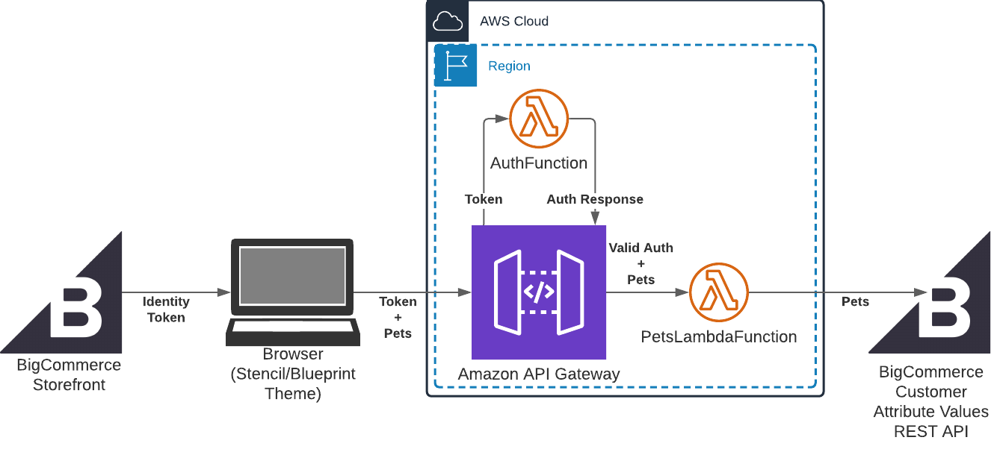

# bc-ciam-demo

## Summary

This is an example app that demonstrates how tokens generated by the BigCommerce [Current Customer API](https://developer.bigcommerce.com/api-docs/storefront/current-customer-api) can be used to authenticate requests to your APIs. To learn more about the general approach, [read about it on Medium](https://medium.com/bigcommerce-developer-blog/using-bigcommerce-customer-identity-access-management-to-authenticate-your-apis-701d48fa57a1?source=friends_link&sk=4a58ab3aec51804696350f81eae0c050).

This example code is responsible for deploying an API that accepts PUT requests from the BigCommerce storefront, authenticates them using a token from the store's Current Customers API, then writes the request body to a customer attribute value in the store. If the customer attribute does not exist in the store, then the Lambda function will create it before writing the attribute value.

While developing the example, I used "Pets" as the attribute name and stored an array of pet objects with information like the pet's name, species, and description in the customer attribute value.



## Project Structure

This project contains source code and supporting files for a serverless application that you can deploy with the AWS Serverless Application Model (AWS SAM) command line interface (CLI). It includes the following files and folders:

- `src` - Code for the application's Lambda function.
- `events` - Invocation events that you can use to invoke the function.
- `template.yml` - A template that defines the application's AWS resources.

Resources for this project are defined in the `template.yml` file in this project. You can update the template to add AWS resources through the same deployment process that updates your application code.

## Preqrequisites

### BigCommerce store
If you do not already have a BigCommerce store, you can create a free trial at [https://www.bigcommerce.com/essentials/](https://www.bigcommerce.com/essentials/).

### API Keys from the store
The application needs API keys to access the BigCommerce Customers API. To learn more about creating API keys in your store, see the [BigCommerce documentation](https://support.bigcommerce.com/s/article/Store-API-Accounts)

### BigCommerce Client ID and Client Secret from devtools.bigcommerce.com
As described in [the Medium article](https://medium.com/bigcommerce-developer-blog/using-bigcommerce-customer-identity-access-management-to-authenticate-your-apis-701d48fa57a1?source=friends_link&sk=4a58ab3aec51804696350f81eae0c050), Client ID and Client Secret generated by the BC store do not work for creating customer identity tokens with the Current Customer API. Instead, you must register an app on https://devtools.bigcommerce.com. You do not need to install the app or even complete the registration fields. For a step-by-step guide, see [the Medium article](https://medium.com/bigcommerce-developer-blog/using-bigcommerce-customer-identity-access-management-to-authenticate-your-apis-701d48fa57a1?source=friends_link&sk=4a58ab3aec51804696350f81eae0c050).

### Decide on a name for the customer attribute
The API will create and update a customer attribute with the name you choose. For my example, I used "Pets" but you may choose a different name for your store.

## Deploy the sample application

The AWS SAM CLI is an extension of the AWS CLI that adds functionality for building and testing Lambda applications. It uses Docker to run your functions in an Amazon Linux environment that matches Lambda. It can also emulate your application's build environment and API.

To use the AWS SAM CLI, you need the following tools:

* AWS SAM CLI - [Install the AWS SAM CLI](https://docs.aws.amazon.com/serverless-application-model/latest/developerguide/serverless-sam-cli-install.html).
* Node.js - [Install Node.js 12](https://nodejs.org/en/), including the npm package management tool.
* Docker - [Install Docker community edition](https://hub.docker.com/search/?type=edition&offering=community).

To build and deploy your application for the first time, run the following in your shell:

```bash
sam build
sam deploy --guided
```

The first command will build the source of your application. The second command will package and deploy your application to AWS, with a series of prompts:

* **Stack Name**: The name of the stack to deploy to CloudFormation. This should be unique to your account and region, and a good starting point would be something matching your project name.
* **AWS Region**: The AWS region you want to deploy your app to.
* **Parameter CUSTOMERATTRIBUTE** The name you chose for your customer attribute.
* **Parameter STOREHASH** The unique store hash for your BigCommerce store. The store hash is visible in the base API path that BigCommerce provided with your store API keys. For more information, see the [BigCommerce documentation](https://developer.bigcommerce.com/api-docs/getting-started/authentication/rest-api-authentication#obtaining-app-api-credentials)
* **Parameter TOKEN** The store API key (also called "access token")
* **Parameter CLIENTID** The Client ID from https://devtools.bigcommerce.com (Note: Using the Client ID that came with your store API key will prevent AuthFunction from validating the customer identity token).
* **Parameter CLIENTSECRET** The Client Secret from https://devtools.bigcommerce.com (Note: Using the Client Secret that came with your store API key will prevent AuthFunction from validating the customer identity token).
* **Parameter DOMAIN** The storefront domain used in the CORS policy for AWS API Gateway.
* **Confirm changes before deploy**: If set to yes, any change sets will be shown to you before execution for manual review. If set to no, the AWS SAM CLI will automatically deploy application changes.
* **Allow SAM CLI IAM role creation**: Many AWS SAM templates, including this example, create AWS IAM roles required for the AWS Lambda function(s) included to access AWS services. By default, these are scoped down to minimum required permissions. To deploy an AWS CloudFormation stack which creates or modifies IAM roles, the `CAPABILITY_IAM` value for `capabilities` must be provided. If permission isn't provided through this prompt, to deploy this example you must explicitly pass `--capabilities CAPABILITY_IAM` to the `sam deploy` command.
* **Save arguments to samconfig.toml**: If set to yes, your choices will be saved to a configuration file inside the project, so that in the future you can just re-run `sam deploy` without parameters to deploy changes to your application.

## Use the AWS SAM CLI to build and test locally

Build your application by using the `sam build` command.

```bash
my-application$ sam build
```

The AWS SAM CLI installs dependencies that are defined in `package.json`, creates a deployment package, and saves it in the `.aws-sam/build` folder.

Test a single function by invoking it directly with a test event. An event is a JSON document that represents the input that the function receives from the event source. Test events are included in the `events` folder in this project.

Run functions locally and invoke them with the `sam local invoke` command.

Note that due to [issue #137 for aws-sam-cli](https://github.com/aws/aws-sam-cli/issues/137), AuthFunction may not be tested locally.

To test PetsLambdaFunction locally:

1. Make a copy of env.json.TEMPLATE and rename it env.json. Fill in the API keys/secret values for your store/app.
2. Modify `requestContext.authorizer.bcCustomerId` in events/authorized-request.json to match your test customer ID.
3. Run

```bash
my-application$ sam local invoke -e events/authorized-request.json --env-vars env.json PetsLambdaFunction
```

or

```bash
my-application$ npm run invoke:PetsLambdaFunction
```

## Cleanup

To delete the sample application that you created, use the AWS CLI. Assuming you used your project name for the stack name, you can run the following:

```bash
aws cloudformation delete-stack --stack-name my-pets
```

## Resources

For an introduction to the AWS SAM specification, the AWS SAM CLI, and serverless application concepts, see the [AWS SAM Developer Guide](https://docs.aws.amazon.com/serverless-application-model/latest/developerguide/what-is-sam.html).

Next, you can use the AWS Serverless Application Repository to deploy ready-to-use apps that go beyond Hello World samples and learn how authors developed their applications. For more information, see the [AWS Serverless Application Repository main page](https://aws.amazon.com/serverless/serverlessrepo/) and the [AWS Serverless Application Repository Developer Guide](https://docs.aws.amazon.com/serverlessrepo/latest/devguide/what-is-serverlessrepo.html).

## License
MIT License
Copyright 2021 Patrick Puente

Permission is hereby granted, free of charge, to any person obtaining a copy of this software and associated documentation files (the "Software"), to deal in the Software without restriction, including without limitation the rights to use, copy, modify, merge, publish, distribute, sublicense, and/or sell copies of the Software, and to permit persons to whom the Software is furnished to do so, subject to the following conditions:

The above copyright notice and this permission notice shall be included in all copies or substantial portions of the Software.

THE SOFTWARE IS PROVIDED "AS IS", WITHOUT WARRANTY OF ANY KIND, EXPRESS OR IMPLIED, INCLUDING BUT NOT LIMITED TO THE WARRANTIES OF MERCHANTABILITY, FITNESS FOR A PARTICULAR PURPOSE AND NONINFRINGEMENT. IN NO EVENT SHALL THE AUTHORS OR COPYRIGHT HOLDERS BE LIABLE FOR ANY CLAIM, DAMAGES OR OTHER LIABILITY, WHETHER IN AN ACTION OF CONTRACT, TORT OR OTHERWISE, ARISING FROM, OUT OF OR IN CONNECTION WITH THE SOFTWARE OR THE USE OR OTHER DEALINGS IN THE SOFTWARE.
